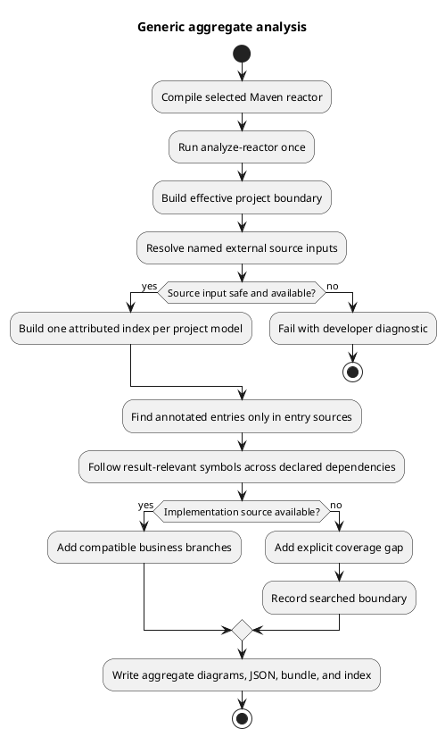
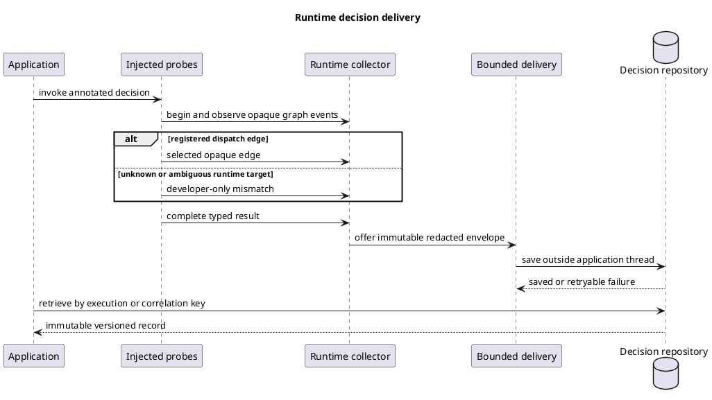

# Design: Generic Application Readiness

## Architecture Overview

The solution adds a release gate around four runtime-independent layers and two runtime layers:

1. Repository integrity proves that every claimed artifact exists in a fresh clone.
2. A Maven aggregate adapter builds an explicit application boundary.
3. Per-project source indexes preserve compiler and module identity.
4. The generic analyzer links reachable symbols across those indexes and emits honest gaps.
5. Runtime capture adds exact selected edges or bounded developer-only diagnostics.
6. An asynchronous delivery service writes versioned records through a storage port.

No layer uses application-specific business knowledge.

## Technical Decisions

### Decision 1: Use one completion spec and one hard release gate

**Context:** The audit findings cross repository, build, analysis, runtime, persistence, and release
boundaries.

**Decision:** Keep one feature specification with ordered tasks. Permit internal milestones, but set
the specification to completed only after the final fresh-clone gate passes.

**Rationale:** The user requested one specification. One release gate prevents partial work from
repeating the current completed-but-missing-artifact state.

### Decision 2: Add a direct aggregate Maven goal

**Decision:** Add an aggregator goal named `analyze-reactor`. The primary command is:

```sh
mvn compile at.gepardec.fachtracing:fachtracing-maven-plugin:<version>:analyze-reactor
```

The direct goal runs once. The preceding `compile` command completes the selected reactor before
analysis. A parent lifecycle binding must not be the primary aggregate mode because Maven can invoke
an aggregator before all children reach the required phase. The existing `analyze` goal remains.

### Decision 3: Model sources by role and project

**Decision:** Replace a flat source universe with an `ApplicationSourceBoundary`:

```text
ApplicationSourceBoundary
  projects[]
    coordinate
    compilerModel
    entrySources[]
    resolutionSources[]
    outputClasspath[]
    dependencies[]
  externalResolutionSources[]
```

Each project gets one attributed compiler task or an equivalent project-safe compiler context.
`SourceIndex` retains project identity with each type and method. A `CrossProjectSymbolResolver`
links types only through Maven dependency edges and attributed type identity.

This design replaces the current approach that removes all module descriptors and merges every
source into one synthetic compilation.

### Decision 4: Keep external sources explicit and resolution-only

**Decision:** Support local additional roots and exact Maven source coordinates. Treat both as
resolution-only unless the user explicitly marks a local root as an entry root. Never scan all
dependencies.

Source artifacts are resolved through Maven's repository session. Extraction occurs below a
plugin-owned build directory. The extractor enforces entry count, total uncompressed bytes,
per-entry bytes, canonical containment, and duplicate-path limits. It rejects links and traversal.

### Decision 5: Make static completeness boundary-relative

**Decision:** A dispatch is complete only for the selected application boundary and only when the
analyzer can prove that each applicable implementation has a source-visible matching member.

The graph records its boundary fingerprint. A diagnostic records searched modules and external
inputs. Business diagrams show only a business-safe coverage-gap statement.

### Decision 6: Version developer provenance for multiple source origins

**Decision:** Add `fachtracing-developer-graph/v2`. Each source mapping references one origin:

- `GIT`: repository, commit, committed timestamp, path, fingerprint, and optional source URL;
- `MAVEN_SOURCE`: exact coordinate, artifact checksum, internal path, and source fingerprint;
- `GENERATED`: producing project, generated-root identity, path, and fingerprint.

V2 never creates a Git URL for Maven or generated source. V1 remains readable and remains available
for a graph whose mapped sources all belong to one clean Git revision.

### Decision 7: Add bounded runtime mismatch diagnostics and context propagation

**Decision:** Registration builds two immutable dispatch indexes:

- exact `(dispatch node, runtime class)` mappings;
- assignable candidate mappings for generated subclasses and proxies.

An exact mapping wins. A unique most-specific assignable mapping can select an existing opaque edge.
No match or an ambiguous match emits a reason-coded developer diagnostic. A fixed-capacity,
deduplicating queue stores diagnostics. Overflow increments a counter. Business execution data never
contains the runtime type.

Replace the process-wide single-manifest assumption with an immutable registry keyed by graph version
and selected class fingerprint. Add a framework-neutral `TraceContextCarrier`. Provide built-in
wrappers for JDK `Executor`, `ExecutorService`, and `CompletionStage` continuations. Capture and
restore use immutable context tokens and always clear restored state in `finally`. An unsupported
boundary produces a diagnostic and incomplete evidence; it does not guess parentage.

### Decision 8: Publish verified capability data

**Decision:** Add a versioned `java-capabilities.json` file. Each capability has a construct,
source-level range, compiler producer, static behavior, runtime behavior, fallback, and contract test.
Documentation is generated or checked against this file.

“Supported” means that the contract test passes. “Gap” means that a result-relevant use produces an
explicit diagnostic and incomplete graph. Dynamic mechanisms can be supported for runtime
correlation without a claim of statically reconstructed source semantics.

### Decision 9: Use asynchronous durable delivery

**Decision:** Keep the current collector in memory on the application thread. Add a bounded delivery
queue and worker service outside the collector. The service sends immutable `DecisionRecordEnvelope`
instances to `DecisionRecordRepositoryV1`.

Provide a JDBC adapter in a separate module. Use JDBC and SQL migrations without a framework
dependency. The adapter supports save, lookup by execution ID, and optional redacted correlation-key
plus time-range queries. The default overload policy rejects new traces after capture admission and
increments a metric; it never blocks or changes the application decision.

### Decision 10: Make the runtime setup explicit and generated

**Decision:** The aggregate goal writes a signed-by-fingerprint activation bundle with graph
manifests, class fingerprints, and configuration metadata. It also writes the exact `-javaagent`
argument for the built artifact. Maven cannot change an arbitrary production JVM command, so the
tool must state this deployment step instead of claiming zero runtime setup.

### Decision 11: Treat Mega as evidence, not input

**Decision:** Restore the Mega overlay, independently reviewed oracles, generated evidence, and
report as tracked conformance data. Validate their recorded hashes and pinned commit. The production
source and generic configuration guard must reject Mega package, class, method, path, and vocabulary
references.

### Decision 12: Make the activation artifact executable configuration

**Decision:** Replace the summary-only activation file with a deterministic runtime bundle. The
bundle contains business graphs, instrumentation manifests, class fingerprints, the boundary
fingerprint, and the Java-agent option. A public engine codec loads the bundle. The agent accepts all
bundle manifests in one configuration and instruments each selected class once.

**Constraint:** Runtime startup does not read Java source and does not use `jdk.compiler`.

### Decision 13: Extract modular graphs in multi-module javac mode

**Decision:** For a connected modular source closure, use one Java compiler task with every module
descriptor, the effective module path, and explicit `module=source-path` mappings. Use this same task
for attribution and graph extraction. Reject incompatible compiler models and unassigned external
sources before extraction. Keep the flat task only for non-modular boundaries.

### Decision 14: Isolate repository calls from bounded delivery shutdown

**Decision:** Run one repository call in an isolated daemon task. The delivery worker waits only for
a configured operation bound. Shutdown interrupts that wait, accounts for the accepted record, and
joins the delivery worker only to a configured deadline. JDBC statements also receive a query
timeout. A repository call that ignores interruption cannot keep the delivery worker active. The
unknown-outcome circuit in Decision 17 prevents further detached calls from that worker.

### Decision 15: Verify Java capabilities by construct behavior

**Decision:** Add one matrix entry and one focused executable method for each required construct.
The verifier binds matrix entries to methods. Each method asserts the expected graph topology or
explicit coverage gap.

### Decision 16: Make execution identity restart-safe and collision-strict

**Decision:** Give each `RuntimeCollector` a random UUID namespace and append its monotonic local
sequence to each execution ID. Keep exact repeated envelopes idempotent. Reject any record-ID or
execution-ID reuse with different immutable content in both in-memory and JDBC repositories.

**Rationale:** A UUID namespace removes restart collisions without shared state or application I/O.
Strict duplicate comparison prevents a storage constraint from hiding a different decision.

### Decision 17: Represent an unconfirmed save as unknown

**Decision:** Add an `unknown` delivery counter. A timeout or interrupted wait marks the active save
as unknown because Java interruption cannot prove that the storage operation did not commit. The
delivery circuit then stops and drops queued, not-started records. This limits an uncooperative
detached operation to one per delivery instance.

**Rationale:** `dropped` means that storage did not save the record. `unknown` states the only result
that the process can prove after an uncooperative operation loses its completion signal.

### Decision 18: Bind bytecode with JVM descriptors

**Decision:** Activation V3 adds a JVM descriptor to each probe, dispatch, and branch binding. Normal
methods match owner, name, and descriptor. Lambda probes also use the enclosing source method
descriptor, and the transformer reads `invokedynamic` bootstrap handles to find only that method's
generated lambda targets. Activation V2 remains readable as a legacy name-only bundle.

**Rationale:** A method name is not a JVM identity. The descriptor separates overloads, while the
lambda bootstrap handle gives the actual generated member without source-name guessing.

### Decision 19: Let the graph-entry project select compiler mode

**Decision:** A graph rooted in a non-modular project uses the flat compatible source context even
when a reverse dependent is modular. A graph rooted in a named module uses a JPMS source context
that contains only named projects; non-modular connected projects remain classpath/module-path
inputs or explicit source-unavailable gaps.

**Rationale:** Reverse dependents help source dispatch discovery, but they do not change the module
identity of the graph-entry project. A mixed reactor is not one synthetic named module set.

## Component Design

### Spec and repository integrity checker

**Responsibility:** Validate index entries, initiatives, dependency references, completed task state,
public file links, conformance inputs, and fresh-clone reproducibility.

**Interface:** `scripts/verify-repository-integrity.sh` and an executable Java contract where
structured parsing is required.

### Analyze Reactor Mojo

**Responsibility:** Read the effective Maven session, apply module selection, build the application
source boundary, run one analysis, and write aggregate output.

**Inputs:** Reactor projects, include/exclude coordinates, additional roots, exact source dependency
coordinates, archive limits, output directory, strict completeness, and optional developer JSON.

**Output:** Aggregate index, Mermaid, PlantUML, developer JSON, activation bundle, boundary report,
and capability report.

### Project source model

**Responsibility:** Capture one project's effective source roots, generated roots, encoding, release,
compiler arguments, module descriptor, output path, dependency edges, and source identity.

**Failure response:** Reject an unsupported compiler-model difference before graph extraction with a
reason-coded diagnostic.

### Cross-project analyzer

**Responsibility:** Analyze roots in project-safe compiler contexts and follow reachable direct or
polymorphic calls across declared project/source indexes.

**Constraint:** This component has no Maven API type in its public engine interface.

### Source artifact resolver

**Responsibility:** Resolve only named source artifacts under Maven repository rules and extract them
safely as resolution-only sources.

### Runtime diagnostic registry

**Responsibility:** Resolve exact or assignable runtime targets and publish bounded diagnostic events
with stable reason codes. The same runtime layer registers several graph manifests and provides
explicit JDK and SPI context propagation.

### Decision delivery service

**Responsibility:** Accept completed immutable records, enforce queue policy, retry asynchronously,
publish counters, and call the storage port.

### JDBC repository adapter

**Responsibility:** Apply versioned migrations and provide durable save and retrieval without leaking
database types into the core model.

## Static Analysis Flow



## Runtime and Persistence Flow



## Decision Record Protocol

```text
DecisionRecordEnvelopeV1
  schema                 constant fachtracing-decision-record/v1
  recordId               opaque stable storage identifier
  executionId            opaque invocation identifier
  graphId                opaque static graph identifier
  graphVersion           integer
  boundaryFingerprint    opaque source-boundary fingerprint
  startedAt              UTC instant
  completedAt            UTC instant
  status                 SUCCEEDED | FAILED | INCOMPLETE
  finalDecision          typed and redacted value, optional on failure
  observations[]         ordered opaque node/edge evidence
  completeness           COMPLETE | INCOMPLETE
  correlationKeys{}      explicitly configured redacted values
  redactionPolicyId      non-secret policy identifier
```

The protocol uses deterministic UTF-8 JSON for interchange. The database adapter stores the schema
version and indexed lookup fields separately from the immutable payload. Incompatible schema changes
require a new schema identifier and a reader compatibility test.

## Database Model

```text
fachtracing_decision_record
  record_id                 varchar primary key
  execution_id              varchar unique not null
  graph_id                  varchar not null
  graph_version             bigint not null
  started_at                timestamp with time zone not null
  completed_at              timestamp with time zone not null
  status                    varchar not null
  correlation_key_hash      varchar null
  schema_id                 varchar not null
  payload                    text/binary not null

indexes
  execution_id unique
  graph_id + completed_at
  correlation_key_hash + completed_at
```

Vendor-specific DDL files can vary only where SQL syntax requires it. The first reference database
must be selected during implementation and added to dependency and CI review before installation.

## Security and Data Handling

- Redaction occurs before an observation enters the delivery queue.
- Correlation keys use approved redaction or keyed hashing before indexing.
- Developer diagnostics can contain Java and Maven details. They use a separate bounded channel.
- Source artifact logs show coordinates but never repository credentials or signed URLs.
- Archive limits and canonical containment prevent traversal and decompression resource exhaustion.
- JDBC credentials belong to the application configuration and never enter a decision record.

## Performance Design

- The aggregate goal indexes each selected project once.
- Source artifacts use a content-addressed extraction cache below the build directory.
- Runtime dispatch uses immutable lookup maps.
- Diagnostic and persistence queues have fixed capacity.
- The application thread performs encoding, bounded offer, and counters only.
- The long test uses 1,000 completed decisions per second for 600 enabled seconds, 32 or more
  concurrent callers, persistence enabled, and repository fault windows.

## Testing Strategy

- Fresh-clone test checks all tracked references before any local build state exists.
- Source-boundary fixtures cover sibling modules, external roots, named source artifacts, offline
  behavior, malicious archives, active reactor selection, and absent source.
- Compiler-model fixtures cover JPMS, duplicate fully qualified names, generated roots, mixed
  encodings, and different supported release settings.
- Runtime tests cover exact class, assignable proxy, ambiguous proxy, missing target, deduplication,
  queue capacity, privacy, multi-graph registration, JDK executor/completion-stage propagation,
  unsupported-boundary diagnostics, and probe isolation.
- Capability contracts cover every supported Java matrix entry and verify visible gaps for each
  unsupported class.
- JDBC tests cover migrations, idempotent save behavior, lookup, query, retention, retry, outage,
  and schema compatibility.
- One external Maven fixture resolves released coordinates and completes static-to-persisted flow.
- Mega and at least two non-Mega domains run with the identical built artifacts and generic settings.
- The full long-load gate includes persistence and runtime diagnostic pressure.

## Rollout Plan

1. Restore repository evidence and make integrity checks mandatory.
2. Add the aggregate source-boundary contract without removing the per-module goal.
3. Add project-safe compiler models and controlled external sources.
4. Add runtime mismatch diagnostics and capability data.
5. Add versioned delivery and the JDBC adapter.
6. Publish a release candidate and run the external-project, Mega, and load gates.
7. Publish a non-snapshot release only after the complete specification passes.

## Risks and Mitigations

- **Risk:** One umbrella specification becomes hard to complete. **Mitigation:** Use ordered tasks and
  one final release gate; do not mark partial milestones as completed.
- **Risk:** Per-project compiler contexts make cross-project calls difficult. **Mitigation:** Persist
  attributed symbol keys and follow only declared dependency edges; use explicit gaps when identity
  cannot be proven.
- **Risk:** Source artifacts add untrusted archive content. **Mitigation:** Exact coordinates,
  Maven policy, extraction limits, canonical containment, and no automatic dependency scanning.
- **Risk:** Assignable proxy matching chooses a wrong branch. **Mitigation:** Accept only one unique
  most-specific registered candidate; ambiguous matches remain diagnostics.
- **Risk:** Persistence outages exhaust memory. **Mitigation:** Fixed queue, explicit admission
  policy, bounded retry, and counters.
- **Risk:** “All Java” becomes an unfalsifiable claim. **Mitigation:** Release claims come only from
  the versioned capability matrix and executable contracts.
- **Risk:** Mega shapes production logic. **Mitigation:** Keep all reference names in conformance and
  run the forbidden-reference plus non-Mega same-artifact tests.

## Dependency Decisions

- Use existing JDK compiler, ASM, Maven, and JDBC APIs where possible.
- Do not add a production dependency for JSON unless the dependency safety gate approves it and the
  design records why the existing deterministic encoder is insufficient.
- A database test container, embedded database, or JDBC driver requires a separate dependency audit
  before installation. The tasks must not assume an unapproved package.
- Maven source artifacts must use the Maven repository session already available to the plugin or an
  approved Maven Resolver API with provided scope.

## Documentation Deliverables

- Maven aggregate-goal guide with single-module and multi-module examples.
- Source-boundary and diagnostic guide.
- Java capability matrix and generated readable table.
- Runtime activation and deployment guide.
- Decision protocol, JDBC migration, retention, and privacy guide.
- Fresh-clone Mega conformance report with immutable evidence hashes.
