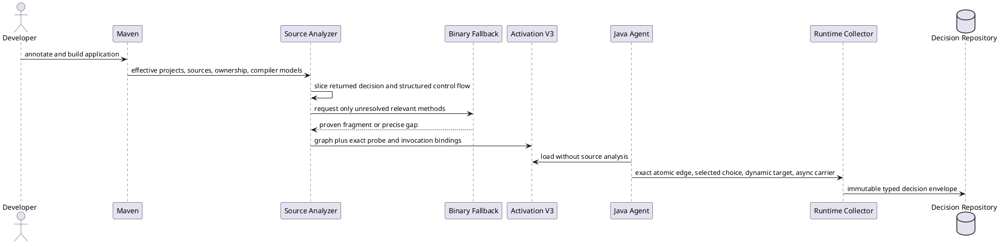
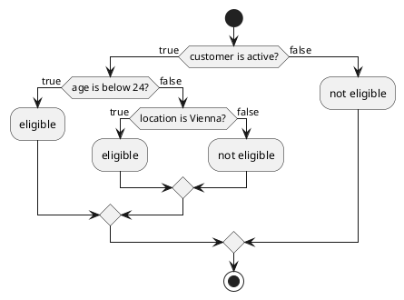

# Design: Generic Java Extractor Completion

## Design Goals

1. Expand result-relevant Java coverage without lowering the completeness contract.
2. Generate business topology from source first, then use bytecode only inside a controlled subset.
3. Precompute exact runtime bindings. Runtime evidence selects a path but never invents topology.
4. Keep Java mechanics and developer provenance outside business graphs and records.
5. Preserve the release candidate's generic, external, Mega, storage, and load behavior.

## Current Boundary

The source analyzer already slices from returned values, follows source-visible calls, models common
branches and loops, and produces explicit gaps. The Java agent injects entry, outcome, dispatch, and
simple Boolean probes from Activation V3. The remaining gaps occur because structured exception
flow and synchronized bodies are rejected, complex Boolean bytecode uses a generic observation,
dynamic calls have no generic invocation binding, async context requires manual wrappers, and
external JPMS sources have no owner.

## System Flow

## Decision 1: Use a control-flow result model

**Decision:** Replace the scanner's single mutable frontier assumption for structured control flow
with a `FlowResult` that separates normal tails, returns, throws, breaks, and continues. A try region
routes typed thrown paths into compatible catch regions. A finally region transforms every outgoing
path and can replace it with its own return or throw.

**Rationale:** Exception flow is not a normal branch merge. Explicit exit kinds prevent catch,
finally, and resource cleanup from reconnecting impossible paths.

**Supported complete subset:** Explicit throws, source-visible declared thrown paths, compatible
multi-catch, nested try/catch/finally, resource initialization with source-visible close behavior,
and a finally block whose result effect is source-attributable. Implicit VM failures and binary-only
close behavior remain gaps unless the binary fallback proves them.

## Decision 2: Treat synchronization as transparent structure

**Decision:** A synchronized statement scans only its block. The monitor expression participates in
dependency analysis only when its value also affects the decision through ordinary source logic.
The graph adds no synchronization node or label.

**Rationale:** Synchronization controls execution safety, not business meaning. Statements inside the
block still have normal Java data and control dependence.

## Decision 3: Compile Boolean expressions into atomic graph plans

**Decision:** Add an `AtomicPredicatePlanner` that recursively lowers `&&`, `||`, `!`, parenthesized
expressions, and Boolean ternaries into atomic predicate nodes and short-circuit continuations.
Negation swaps true and false continuations. Every atomic node owns exact true and false graph edges.
The manifest binds ordered atomic sites, not one compound node.

**Rationale:** One compound node cannot show which operands ran. The lowered graph represents Java
evaluation order and lets runtime select an exact edge for every evaluated fact.

The bytecode transformer accepts an exact plan only when all atomic sites correlate by owner,
descriptor, source position, occurrence, and expected jump form. It rejects partial correlation.

## Decision 4: Add exact switch targets

**Decision:** Add manifest `ChoiceTarget` bindings for conditional, table-switch, and lookup-switch
instructions. Each target maps a bytecode key or default to one opaque graph edge. String and enum
switch lowering uses its complete compiler-generated comparison plan and final switch instruction.

**Rationale:** Switch selection has more than two outcomes and cannot use Boolean `BranchTarget`.

## Decision 5: Separate static candidates from runtime invocation evidence

**Decision:** Add `DynamicInvocationTarget` bindings with call-site identity and each proven
candidate's owner, member, descriptor, and edge. The agent observes supported proxy calls,
`ServiceLoader` provider use, and `Method.invoke`. The collector selects a candidate only when one
exact or one unique most-specific binding matches.

**Rationale:** Runtime type evidence can disambiguate a static candidate set. It cannot prove a
candidate that static or binary analysis did not establish.

Unknown and ambiguous evidence creates a bounded diagnostic and adds an execution coverage gap.
Business records contain only the gap's business-safe description and opaque IDs.

## Decision 6: Use source artifacts before a controlled binary fallback

**Decision:** Maven source dependencies and owned external sources remain the first resolution path.
For an unresolved relevant call, `BytecodeDecisionAnalyzer` reads the exact class fingerprint with
ASM. It accepts only straight-line values, field reads, supported calculations, comparisons,
conditional jumps, and returns. It rejects exception tables, arbitrary invokedynamic, monitors,
native methods, subroutines, and calls outside a small pure-operation allowlist.

**Rationale:** This subset can reconstruct a useful decision without pretending to understand
arbitrary bytecode. The fallback is deterministic, fingerprinted, and fail-closed.

The fallback uses method-parameter metadata, field names normalized by the existing business
renderer, and constants. If safe vocabulary is unavailable, it reports a gap instead of exposing
slots or opcodes.

## Decision 7: Inject automatic context wrapping at application call sites

**Decision:** Extend the application-class transformer to wrap functional arguments before calls to
supported Java concurrency APIs. The bridge supplies idempotent wrappers for `Runnable`, `Callable`,
`Function`, `Consumer`, `BiFunction`, `BiConsumer`, and `Supplier`. Supported call sites include
`Executor.execute`, common `ExecutorService.submit` forms, `CompletableFuture` and
`CompletionStage` callback registration, `Thread.startVirtualThread`, and builder `start` methods.

**Rationale:** Call-site injection works without bootstrap-class transformation and captures the
context that exists when the task is submitted. Existing manual wrappers stay valid and are not
wrapped twice.

Every wrapper restores its captured invocation stack, runs the delegate, and restores the previous
worker state in `finally`. An inactive trace returns the original delegate.

## Decision 8: Add explicit module ownership to resolution sources

**Decision:** Extend `ResolutionSource` with `ModuleOwnership`:

- `UNNAMED` for flat sources.
- `NAMED(moduleName, descriptor, sourceRoot)` for a named external module.
- `AUTOMATIC(moduleName, binaryPath, sourceRoot)` for source paired with an automatic module.

Modular analysis groups owned sources with the selected named-module task. Automatic-module source
is attributed through the corresponding binary module while its parsed source supplies method
bodies. Conflicting ownership or unreadable modules fail before extraction.

**Rationale:** A path alone cannot be placed in a JPMS compiler context. Explicit ownership makes the
input deterministic and keeps Maven's valid build model authoritative.

## Decision 9: Add PostgreSQL as a required CI storage contract

**Decision:** Add pgJDBC 42.7.13 as a test-only dependency. A separate executable contract reads its
connection from environment variables and runs against PostgreSQL 18.4 in GitHub Actions. H2 stays
as the fast local reference.

**Rationale:** PostgreSQL exercises real transaction, constraint, timestamp, binary payload, and
statement-timeout behavior without adding a production driver dependency.

## Decision 10: Run release evidence on every pull request

**Decision:** Add one pull-request workflow with read-only contents permission. It uses official
`actions/checkout@v7` and `actions/setup-java@v5`, Java 21, Maven caching, a PostgreSQL 18.4 service,
the standard verifier, pinned Mega conformance, and the 600-second release gate.

**Rationale:** The definition of done requires the same evidence for each pull request. A short CI
job cannot replace the long gate.

## Data Model Changes

`AnalysisManifest` gains additive developer-only plans:

- `ChoiceTarget`: one choice node, method identity, bytecode occurrence, and case-to-edge map.
- `DynamicInvocationTarget`: one call site and its statically proven candidates.
- `BinaryOrigin`: class fingerprint and method descriptor for a fallback fragment.
- Atomic predicates continue to use `ProbeSite` and `BranchTarget`, but each source atom receives its
  own node and pair of graph edges.

Activation V3 can add these fields because its reader ignores unknown additive fields. Older V3
bundles omit the lists and keep current behavior. Activation V2 remains name-only readable.

## Failure and Completeness Rules

- No supported construct becomes complete until its independent static and runtime contract passes.
- Partial Boolean, switch, exception, dynamic, bytecode, async, or module plans are rejected.
- Each gap includes source, line, construct kind, missing evidence, and one corrective action.
- Runtime ambiguity never changes a static graph to complete.
- Developer diagnostics remain bounded and deduplicated.

## Security and Privacy

- Reflection and service evidence records no raw arguments or returned objects unless the existing
  typed codec and redactor accept them.
- CI uses no pull-request secrets and has `contents: read` permission.
- PostgreSQL CI credentials are local service credentials only.
- Source ownership, descriptors, bytecode identities, fingerprints, and exception types stay in
  developer artifacts.
- Dynamic candidate selection uses exact allowlisted bindings from the activation bundle.

## Verification Strategy

Each capability has an independent fixture and executable test. Aggregate gates run:

1. Analyzer, transformer, runtime, protocol, Maven, and JDBC focused contracts.
2. External release integration that loads Activation V3 without source or compiler.
3. Pinned Mega conformance with five exact reviewed graphs and forbidden-reference scan.
4. PostgreSQL 18.4 storage integration.
5. A clean-clone 60-second baseline plus 600-second enabled load at 1,000 RPS.

## Rollback

All manifest additions are additive. If a new exact plan cannot correlate, the analyzer emits a gap
and the agent does not install that plan. Automatic async wrapping can be disabled through agent
configuration while manual wrappers remain available. PostgreSQL is test scope only. The CI workflow
can be reverted without changing published artifacts.

