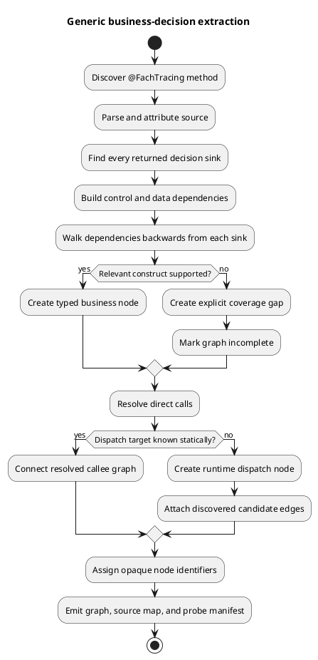
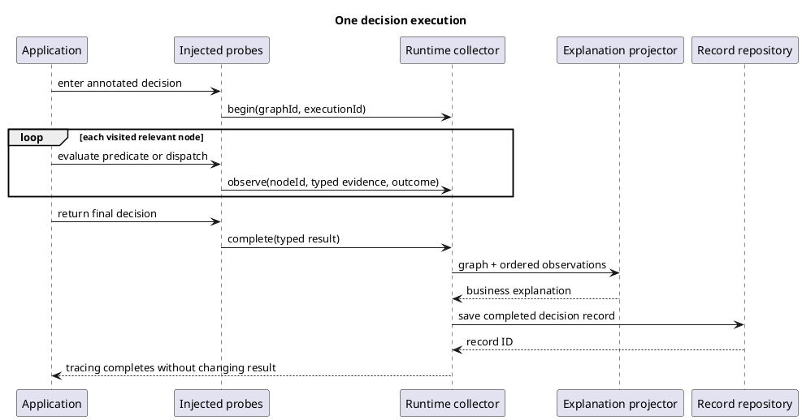
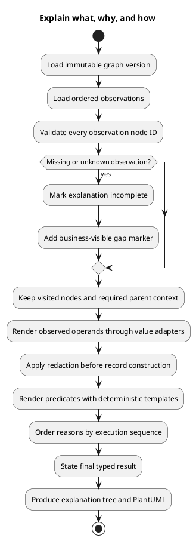
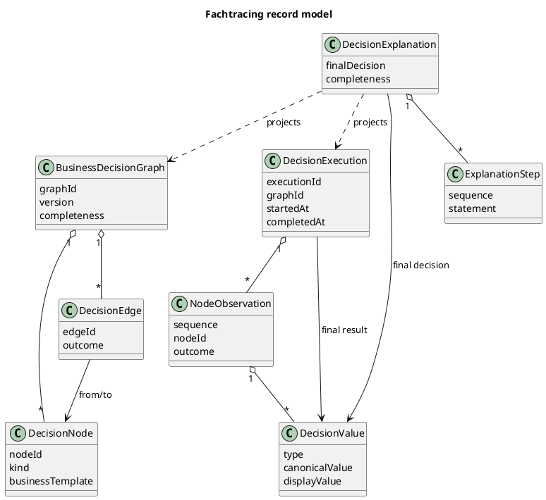

# Design: Generic Fachtracing Walking Skeleton

## Architecture Overview

The library learns a decision domain from code rather than configuration. At build time, an attributed Java syntax tree gives the analyzer control flow, symbols, types, and call targets; backward slicing from each return retains only operations that can affect the result. At runtime, bytecode probes emit compact observations keyed by opaque static node IDs. A projection combines the immutable graph with one observation stream to produce a business explanation and PlantUML without leaking Java implementation details.

The static structure is a graph because calls and subdecisions can be shared. A specific execution becomes a tree-shaped explanation because it follows one ordered path and can expand repeated observations separately.

## Technical Decisions

### Decision 1: Learn structure from attributed source

**Decision:** Use the Java 21 `jdk.compiler` Tree and utility APIs to parse and attribute source, then construct an internal control/data-dependency representation.

**Rationale:** Plain text or regex cannot resolve symbols, overloads, nested expressions, or modern Java syntax. Bytecode alone loses source-level business expressions. The compiler APIs expose typed AST nodes without adding a parser dependency, and source attribution lets the analyzer connect expressions to definitions and calls.

**Discarded option:** Domain-specific configuration was rejected because it contradicts the requirement to analyze previously unknown methods.

### Decision 2: Remove technical work by relevance, not names

**Decision:** Define “business-relevant” as transitively control- or data-dependent on a returned decision. Start at all return-value sinks and compute a backward slice through predicates, assignments, and calls.

**Rationale:** A package name, annotation list, or vocabulary classifier would encode prior domain knowledge and fail on unknown applications. Program dependence gives a falsifiable, domain-neutral rule: an operation remains only when changing it can change the decision or the path to that decision.

**Constraint:** Side effects that do not affect the returned decision are excluded from the business graph even when a business team considers them important. Later specs may add explicit secondary decision sinks without weakening this rule.

### Decision 3: Correlate through opaque stable node IDs

**Decision:** Assign each result-relevant AST node an internal ID derived from the graph version, normalized source position, node kind, and structural fingerprint. Store only the opaque ID in business records.

**Rationale:** Runtime probes need a stable correlation key, but Java source coordinates and signatures are technical details. A separate developer-only source map retains provenance for diagnostics; the business graph contains opaque IDs and business labels.

### Decision 4: Resolve dynamic dispatch at runtime

**Decision:** Represent statically unresolved interface and abstract calls as dispatch nodes with discovered candidate edges. Instrument the call site and selected target so the execution observation binds the opaque dispatch node to the edge actually taken.

**Rationale:** Static analysis can bound candidates from the compilation classpath but cannot know which implementation an invocation selects. Runtime evidence completes the graph without pretending that static resolution is exact.

### Decision 5: Use deterministic explanations

**Decision:** Build explanations from normalized source expressions, source documentation when available, observed operands, branch results, and the final result. Use deterministic templates rather than an LLM.

**Rationale:** Deterministic output is testable, reproducible, and suitable for confidential decision data. For example, a less-than predicate renders as “{left label} was below {right value}; observed {left value}.” Raw class and method signatures never enter this projection.

### Decision 6: Fail open for application behavior, fail explicit for trace completeness

**Decision:** Instrumentation errors do not change an annotated method's return or exception. The trace becomes incomplete and receives an external diagnostic and visible coverage marker.

**Rationale:** An explainability feature must not alter the business decision it observes. Silent trace corruption is also unacceptable, so completeness and application success are separate states.

### Decision 7: Treat `mega-backend` as an opaque conformance corpus

**Decision:** Validate the published Fachtracing artifacts against a pinned
`Gepardec/mega-backend` revision through a test-only integration overlay and independently
reviewed semantic graph oracles. Reference-specific paths, entry-point selection, invocation
data, and expected graphs live only under conformance-test artifacts. Production analyzer,
agent, model, renderer, and generic configuration may not contain Mega identifiers or hints.

**Rationale:** Mega provides realistic brownfield depth, framework integration, nested calls,
and polymorphism that synthetic fixtures cannot reproduce. Allowing it to influence production
rules would prove only a Gepardec adapter rather than a generic extractor.

**Consequences:** A Mega-discovered missing construct must first become a domain-neutral language
capability with its own construct fixture. Conformance requires exact semantic topology for the
selected methods and simultaneous regression success on non-Mega domains. Golden oracles may
judge output but may never guide extraction.

## Product Module Design

### Annotation API

**Responsibility:** Mark a method as a Fachtracing entry point and expose stable extension interfaces for values and redaction.

**Interface:** `@FachTracing`, `DecisionValueAdapter`, and `DecisionValueRedactor`.

### Static Analyzer

**Responsibility:** Turn attributed Java source reachable from one annotated method into a result-relevant graph and coverage report.

**Interface:** `AnalysisResult analyze(AnalysisRequest request)`.

### Graph Model

**Responsibility:** Represent immutable graph definitions, opaque nodes, edges, typed result values, runtime observations, and completeness.

**Interface:** Java records and sealed interfaces with no framework dependencies.

### Bytecode Instrumenter

**Responsibility:** Inject observation probes at graph-correlated bytecode locations without changing application semantics.

**Interface:** Java agent `ClassFileTransformer` configured with an analysis manifest.

### Runtime Collector

**Responsibility:** Isolate invocation context and append compact, ordered observations for the current annotated call.

**Interface:** `begin`, `observe`, `complete`, and `fail` operations used only by injected probes.

### Explanation Projector

**Responsibility:** Combine one graph definition and execution record into a business-only explanation tree.

**Interface:** `DecisionExplanation explain(BusinessDecisionGraph graph, DecisionExecution execution)`.

### PlantUML Renderer

**Responsibility:** Render a structural graph or one explanation path as deterministic PlantUML source.

**Interface:** `renderStructure` and `renderExecution`.

### Decision Record Repository

**Responsibility:** Persist and retrieve completed decision records behind a storage-neutral port.

**Interface:** `save(DecisionRecord)` and `findById(DecisionRecordId)`; this spec supplies an in-memory implementation only.

## Business-Logic Extraction Flow

## Runtime Correlation Flow

## Explanation Construction Flow

## Decision Record Model

## Internal Correlation Model

The build produces two artifacts with different audiences:

1. The **business graph** contains opaque node IDs, business templates, graph topology, result types, and completeness. It is safe for decision records.
2. The **developer source map** links node IDs to source files, symbols, bytecode locations, and diagnostics. It never appears in the business-facing record or PlantUML.

This separation preserves runtime correlation without filling the explanation with Java details.

## Supported Walking-Skeleton Constructs

| Java construct | Graph behavior |
| --- | --- |
| `if` / `else` | Predicate node with true/false edges |
| switch statement/expression | Choice node with case edges |
| `&&`, `||`, `!` | Short-circuit predicate nodes preserving evaluation order |
| comparisons | Predicate node with typed operand slots |
| local assignment | Included only when it feeds a relevant node or result |
| direct method call | Inline/link result-relevant callee slice within configured analysis boundary |
| interface/abstract call | Dispatch node completed by runtime evidence |
| return | Outcome node with typed final value |
| unsupported relevant construct | Coverage-gap node; graph marked incomplete |

## Result Value Contract

`DecisionValue` is a tagged value with `type`, `canonicalValue`, and redacted `displayValue`. Built-in adapters support:

- `boolean`
- arbitrary-precision `number`
- `category` for enums and explicitly categorical values
- `string`

Custom adapters can add types such as dates, money, or domain identifiers. Unknown objects are rejected rather than stringified.

## Failure Modes

| Failure | System response |
| --- | --- |
| Source cannot be attributed | Emit analysis diagnostic; do not produce a complete graph |
| Relevant construct unsupported | Preserve a coverage-gap node and incomplete status |
| Runtime node does not exist in graph version | Reject the observation, preserve application result, mark trace incomplete |
| Probe or collector throws | Suppress tracing failure from application flow; send diagnostic to the developer channel |
| Value adapter missing | Record a redacted unavailable-value marker; never call arbitrary `toString()` |
| Repository unavailable | Return application result; buffer or drop the trace according to repository policy and record a metric |

## Testing Strategy

- Unit tests derive each analyzer case from an EARS criterion and inspect complete graph topology, not implementation visitors.
- Characterization fixtures cover direct decisions, nested calls, short-circuit branches, and irrelevant technical side effects.
- A polymorphic fixture has at least two strategy implementations and verifies the runtime-selected path.
- End-to-end tests compile fixture code, analyze it, instrument it, invoke it, save the record, retrieve it, and compare explanation and PlantUML snapshots.
- Negative tests verify explicit gaps for unsupported relevant constructs and unchanged application behavior when capture fails.
- A concurrency test uses 32 threads and verifies observation isolation.
- A benchmark sustains 1,000 completed invocations per second for ten minutes and compares enabled tracing with an instrumented-but-disabled baseline.
- A brownfield conformance suite checks out the pinned Mega revision, applies only a test annotation
  overlay, and selects at least three decision entries across two business areas, including a
  polymorphic path.
- Independent reviewers derive expected semantic nodes, edges, outcomes, and actual-path evidence
  from Mega source before comparing generated graph, explanation, and PlantUML artifacts.
- A forbidden-reference guard scans production source and generic configuration for Mega repository,
  package, class, method, and business-vocabulary identifiers; only conformance artifacts may name them.
- Every Mega-motivated analyzer change first passes a minimal generic construct fixture, and the
  identical built artifact reruns at least two structurally different non-Mega domains.

## Ship Plan

1. Implement the public model and annotation without framework dependencies.
2. Prove static slicing on two structurally different fixture domains.
3. Add runtime probes and polymorphic correlation.
4. Add explanation, PlantUML, and in-memory persistence.
5. Run end-to-end, concurrency, and load verification before declaring the walking skeleton complete.
6. Run the pinned Mega brownfield conformance suite and publish reviewed graph/runtime evidence
   before restoring completed status.

## Risks & Mitigations

- **Source expressions may contain poor identifiers:** Mark label quality in diagnostics and allow optional documentation-derived labels; never invent unsupported business semantics.
- **Source-to-bytecode correlation may drift after compilation:** Bind the probe manifest to graph and class fingerprints and reject mismatches.
- **Instrumentation may alter timing or behavior:** Keep probe methods non-throwing, avoid synchronous I/O, and compare results/exceptions against non-instrumented characterization tests.
- **Program slicing can omit business-relevant side effects not returned:** Define return values as the walking-skeleton decision sinks and add explicit secondary sinks in a later spec.
- **Loops can make a graph cyclic:** Preserve cycles in the static graph and render repeated runtime observations as ordered explanation steps; extended loop analysis is deferred.
- **Reference-driven overfitting can appear generic in local tests:** Prohibit Mega identifiers and
  hints in production/configuration, require construct-level generic tests for every discovered gap,
  and rerun non-Mega domains with the same artifact.
- **A golden graph can encode reviewer mistakes:** Record source revision and selection rationale,
  require independent code-derived review, and compare semantic topology rather than unstable IDs
  or source coordinates.

## Dependency Decisions

| Package | Version | Ecosystem | Decision | Rationale |
| --- | --- | --- | --- | --- |
| Java Compiler Tree API (`jdk.compiler`) | Java 21 | JDK | Approved | Built into the validation baseline; provides typed AST nodes and symbol utilities without a third-party parser. |
| `org.ow2.asm:asm` | 9.10.1 | Maven | Approved | Narrow bytecode visitor API for injecting probes; current upstream release at specification time, BSD-3-Clause, no transitive runtime dependencies, and no OSV advisories returned for this version. |

No parser, framework, database, serialization, logging, or PlantUML library is introduced by this spec. PlantUML output is generated as deterministic text.

## Dependencies & Blockers

### Spec Dependencies

| Dependent Spec | Reason | Required | Status |
| --- | --- | --- | --- |
| — | Walking skeleton has no predecessor | — | — |

### Cross-Spec Blockers

| Blocker | Blocking Spec | Resolution Type | Resolution Detail | Status |
| --- | --- | --- | --- | --- |
| — | — | — | — | — |
