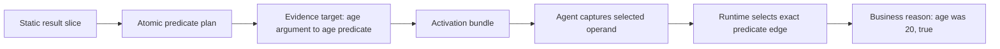
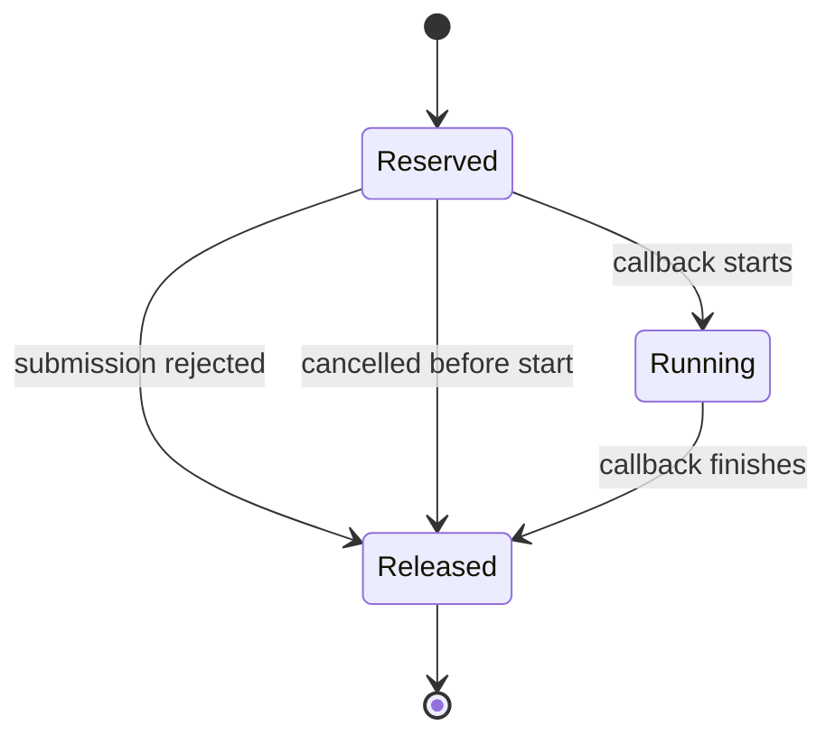

# Design: Release, Explanation, and Async Correctness

## Design Goals

1. Make release success depend on the producer command status.
2. Generate runtime evidence bindings from the static result slice.
3. Give every async reservation a single terminal lifecycle.
4. Match supported Java async APIs by exact signature and callback position.
5. Lower indexed iteration before business graph nodes are emitted.

## Decision 1: Capture release output without a status-hiding pipeline

The release script runs the producer block with output redirected to a temporary evidence file. It
stores the producer status, copies the output to the terminal and final evidence file, and exits
with the stored status before it can append metadata or print success. The script uses POSIX shell
features only. Repository integrity uses `grep`, `sed`, `awk`, `find`, and Git, which are declared
runner tools.

A focused harness uses an environment-selected release command fixture. The fixture fails before
the expensive external and load gates. The contract asserts a non-zero status, retained failure
text, and no success marker.

## Decision 2: Add predicate operand evidence bindings

`AnalysisManifest` gains `EvidenceTarget` entries. Each entry contains:

- the predicate node ID;
- the exact owner, method, and JVM descriptor;
- a zero-based method argument index;
- a business-safe evidence label;
- the source line for correlation.

The static analyzer creates a target only when an atomic predicate operand resolves to a parameter
of the instrumented method and that operand is in the backward result slice. Identifier-like labels
that normalize to no business text are rejected. This first exact subset is fail-closed. A later
extension can add local-value and field-value target kinds without restoring blanket capture.

The transformer captures each selected parameter once after `begin` and associates it with the
predicate node. `RuntimeCollector.observeEvidence` merges the typed value into the next observation
for that predicate. Predicate edge capture consumes the pending evidence. The explanation renderer
then shows the fact beside the selected outcome. Entry argument capture is removed.

This model does not store irrelevant identifiers. It also preserves the existing value codec and
redactor boundary.

## Decision 3: Use a reservation state object

Every automatic async wrapper owns one `AsyncReservation` with these states:

```text
RESERVED -> RUNNING -> RELEASED
RESERVED -> REJECTED -> RELEASED
RESERVED -> CANCELLED -> RELEASED
```

All transitions are atomic and only the winning terminal transition decrements the invocation
reservation. Wrapper execution changes `RESERVED` to `RUNNING`. Completion releases from `RUNNING`.
Submission failure and cancellation release from `RESERVED`. A late callback after cancellation
runs without the captured trace context and cannot release again.

The transformer places a submission marker around exact executor calls. On a thrown submission it
calls `TraceRuntime.rejectAsyncArguments` before it rethrows the same object. For calls that return
a `Future`, the runtime can return a delegating future that releases the linked reservation when
`cancel` succeeds before callback start. The delegating future preserves all other `Future`
behavior.

## Decision 4: Use an exact async invocation catalog

`AsyncInvocationCatalog` is immutable production metadata in the agent. A binding is:

```text
(owner, method, descriptor) -> callback argument index, wrapper kind, lifecycle kind
```

The catalog names only supported JDK APIs. It includes exact `Executor`, `ExecutorService`,
`ForkJoinPool`, `CompletionStage`, `CompletableFuture`, and `Thread` forms. Interface and virtual
dispatch use a small declared owner-family match only after the exact method descriptor matches.

The transformer moves the selected callback argument to the top of the operand stack with local
spill slots when its position is not last. It wraps that callback and restores the original
invocation argument order. It does not use `SWAP` for values of unknown width.

Known async owners with an unmatched boundary call `unsupportedAsyncBoundary`. Blocking methods,
state queries, lifecycle control, and other methods that do not register work are explicitly
classified as non-boundaries.

## Decision 5: Lower canonical indexed loops as a unit

Before `FlowScanner` visits a `ForLoopTree`, `IndexedLoopRecognizer` checks for this generic shape:

- one integer counter initialized to zero;
- a condition that compares the counter with one collection or array length;
- one unit increment;
- body access to the same collection by the same counter.

When the shape is proven, the scanner does not visit the initializer, condition mechanics, item
access definition, or update as business nodes. It emits one choice named `a following entry
exists`. Body statements still use the ordinary result slice. A local alias such as
`entry = entries.get(index)` is transparent, like an enhanced-for variable binding.

If the loop does not match this shape, the existing general loop analysis remains and completeness
rules do not change. The generic artifact guard checks implementation patterns, not business words
in isolation, so a valid business fact such as `company size` stays allowed.

Dynamic dispatch uses the destination business-rule node label as the edge outcome. No edge or node
attribute contains an ordinal candidate number.

## Data Flow





## Compatibility

- The activation JSON change is additive. Missing `evidenceTargets` means no operand capture.
- Existing manifest constructors keep empty evidence-target lists.
- Manual runtime observation and context wrapper APIs stay valid.
- The same generic analyzer and transformer process fixtures and Mega Backend.
- Business graph IDs can change when loop topology changes. Reviewed Mega oracles must change only
  after the generic guard and manual graph review pass.

## Verification Strategy

1. Run focused shell release contracts without network or the long load gate.
2. Run analyzer and transformer evidence tests with an irrelevant identifier beside `age`.
3. Run collector lifecycle races and transformed caught/uncaught rejection tests.
4. Run one contract for each corrected callback position and one unmatched-boundary gap.
5. Run generic indexed-loop extraction and graph artifact guards.
6. Run standard verification, external activation, Mega conformance, PostgreSQL, and the clean-clone
   release gate.

## Rollback

All manifest data is additive. If evidence correlation fails, the transformer does not capture that
operand and the graph stays incomplete when evidence is required. The async catalog can remove one
bad binding without changing the public API. Indexed-loop lowering applies only to a proven
canonical shape; other loops keep the existing path.
