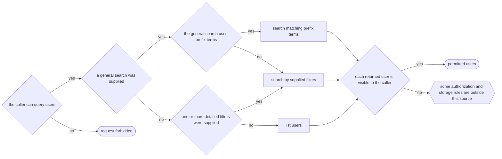

# Keycloak endpoint business tracing

This example traces the pinned Keycloak user-search endpoint without changing Keycloak source. It
generates a reviewed non-technical Mermaid overview and a runtime activation file for `search users`.



The harness checks the overview against required rule anchors in the exact 169-node analysis. The
overview groups repeated filter-building operations so a non-technical reader can use it. The
runtime activation keeps the exact graph, so each called endpoint still records its actual path.

## Generate the graph and activation

Prepare a clean checkout:

```sh
git clone https://github.com/keycloak/keycloak.git /tmp/fachtracing-keycloak
git -C /tmp/fachtracing-keycloak checkout eba869ee597b933efc8fa2c84713db9e6c0983cf
```

Then run:

```sh
./scripts/verify-keycloak.sh
```

Set `KEYCLOAK_DIR` when the checkout is elsewhere. The command builds the Keycloak `services`
module and can take longer than the three-minute pull-request gate. It is an explicit external
conformance command and is not part of pull-request CI.

The command writes these disposable files under `conformance/keycloak/target/generated`:

- `search-users-business.mmd`: the reviewed static non-technical overview.
- `activation.json`: exact probes and class fingerprints for the pinned build.

## Call the endpoint and get the evaluated flow

Use a Keycloak distribution built from the pinned revision. Build this Fachtracing repository first.
Make the matching API, engine, agent, and ASM JARs visible to the bootstrap loader because the agent
JAR is not an aggregate JAR. The exact distribution start command can differ by Keycloak build.
For a local development distribution, the JVM options have this form:

```sh
FACHTRACING_ROOT=/path/to/fachtracing
FACHTRACING_OUTPUT=/tmp/keycloak-business-traces
FACHTRACING_ACTIVATION="$FACHTRACING_ROOT/conformance/keycloak/target/generated/activation.json"
FACHTRACING_BOOT="$FACHTRACING_ROOT/fachtracing-api/target/fachtracing-api-0.1.0-rc.1.jar:$FACHTRACING_ROOT/fachtracing-engine/target/fachtracing-engine-0.1.0-rc.1.jar:$HOME/.m2/repository/org/ow2/asm/asm/9.10.1/asm-9.10.1.jar:$HOME/.m2/repository/org/ow2/asm/asm-tree/9.10.1/asm-tree-9.10.1.jar"
export KC_BOOTSTRAP_ADMIN_USERNAME=admin
export KC_BOOTSTRAP_ADMIN_PASSWORD=change-me
export JAVA_OPTS_APPEND="-Xbootclasspath/a:$FACHTRACING_BOOT -javaagent:$FACHTRACING_ROOT/fachtracing-agent/target/fachtracing-agent-0.1.0-rc.1.jar=activation=$FACHTRACING_ACTIVATION,output=$FACHTRACING_OUTPUT"
bin/kc.sh start-dev
```

In another shell, request an administrator token and call the endpoint:

```sh
TOKEN=$(curl --fail --silent \
  --data client_id=admin-cli \
  --data username=admin \
  --data password=change-me \
  --data grant_type=password \
  http://localhost:8080/realms/master/protocol/openid-connect/token | jq -r .access_token)
curl --fail --silent \
  --header "Authorization: Bearer $TOKEN" \
  "http://localhost:8080/admin/realms/master/users?search=admin"
```

Each call creates one `.txt` explanation and one `.mmd` evaluated path in
`/tmp/keycloak-business-traces`. The files use business statements and `REDACTED` values. They do
not contain Java owners, methods, source paths, request values, tokens, or exception details. A
successful call reports `Completed`. The incomplete coverage line uses one business-safe statement
and does not expose the developer diagnostics.

The static graph and live call are separate checks. The conformance command verifies the pinned
source selection, non-technical projection, activation, and class fingerprints. A live Keycloak
call is local because it needs a running distribution, an administrator account, a free port, and
startup time outside the repository CI budget. See [the exact selection](selection.md) for the lazy
stream boundary and its explicit incomplete-coverage behavior.
