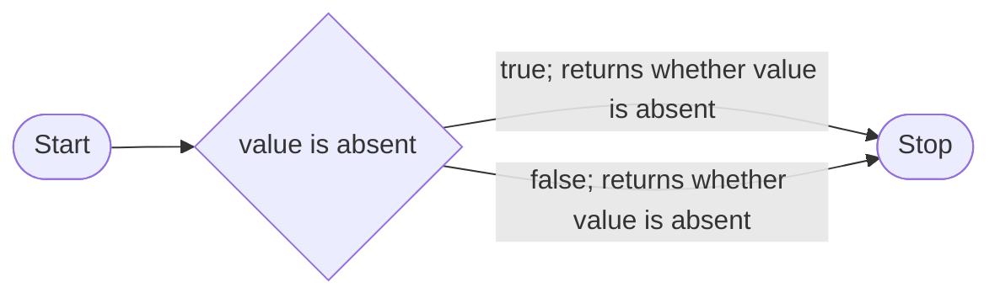
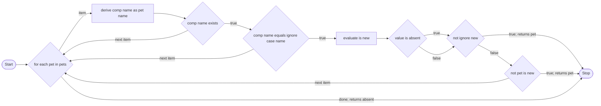
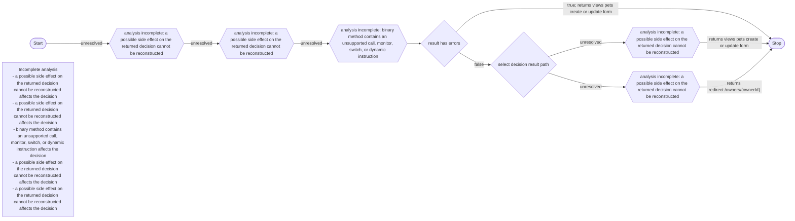

# Spring PetClinic conformance report

Status: **passed**
Pinned source: `spring-projects/spring-petclinic@88e37c15cf6fc8490b01bc3e8e2c800cec1ac272`
Run date: 2026-08-07, Java 21

## What this test shows

Fachtracing finds methods marked with one public annotation. It reads the reachable Java logic and creates a business graph. It removes Java names that do not add business meaning. If the analyzer cannot prove a result-relevant effect, it adds a visible coverage gap.

The PetClinic suite shows this behavior at three levels. No Spring integration or PetClinic-specific production configuration exists.

## 1. A simple state decision

The source returns whether the persistence value is absent. Fachtracing converts this into one complete business predicate with both results connected to one Stop.



Result: **complete**, 3 nodes, 3 edges.

## 2. A domain lookup

The source searches the owner's pets by name. It can exclude a matching pet that is not saved yet. Fachtracing shows the loop, the atomic name checks, the eligibility checks, the early found result, and the absent result after the loop.



Result: **complete**, 10 nodes, 15 edges.

## 3. An application workflow with proof limits

The new-pet controller uses compiled Spring validation objects and persistence calls. Fachtracing can prove the visible error-result predicate and the terminal view or redirect results. It cannot reconstruct five result-relevant binary side effects. The graph shows these limits as explicit gap nodes.



Result: **incomplete**, 9 nodes, 10 edges, 5 explicit gaps.

This is a conformance success. The graph tells the reader which paths are proved and which paths need more source or supported bytecode semantics.

## Reproduce the result

Clone the pinned PetClinic repository to `/tmp/fachtracing-spring-petclinic`, or set `SPRING_PETCLINIC_DIR` to its location. Then run:

```sh
./scripts/verify-spring-petclinic.sh
```

The command checks the clean revision, applies only `annotation-overlay.patch`, analyzes all 30 main Java files, compares immutable semantic oracles, and writes disposable output under `target/generated`.
