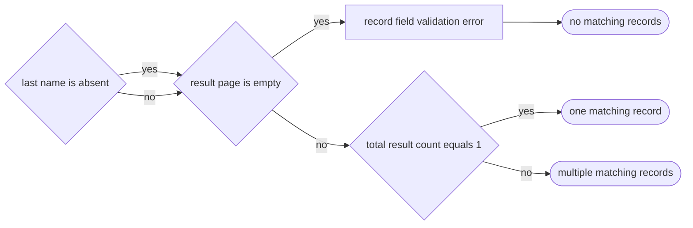
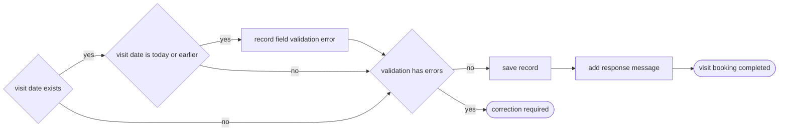
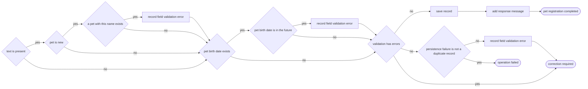

# Spring PetClinic business-graph conformance report

- Status: **passed locally**
- Pinned source: `spring-projects/spring-petclinic@88e37c15cf6fc8490b01bc3e8e2c800cec1ac272`
- Run date: 2026-08-11, Java 21

## What the test shows

The source overlay adds only three `@FachTracing` annotations. Fachtracing combines source analysis with the optional Spring contract adapter. It then creates a separate business graph. The exact analysis graph stays unchanged for developer checks and runtime tracing.

All three workflows are complete for the annotated Java method. There are no business `GAP` nodes. Spring request binding and `@Valid` results are method inputs.

## Owner search



Result: **complete**, 7 business nodes and 7 business edges.

## Visit booking



Result: **complete**, 8 business nodes and 9 business edges.

## Pet registration



Result: **complete**, 15 business nodes and 20 business edges. The two equivalent correction results use one result node.

## Reproduce the result

```sh
./scripts/verify-spring-petclinic.sh
```

The command checks the clean pinned revision, applies the annotation-only overlay, analyzes the full main source set, compares the reviewed JSON oracles, validates the JSON schema, and writes generated artifacts under `conformance/spring-petclinic/target/generated`.
