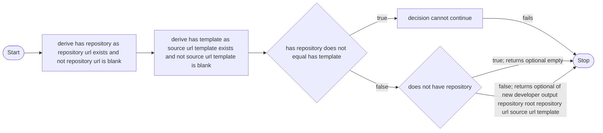

# Self-Tracing Fachtracing

Fachtracing applies its own business-tracing flow to one production decision. This example connects
the Maven plugin, static analysis, activation data, the Java agent, and runtime execution records.

The traced method is `ProjectGraphGenerator.developerOutput`. It decides if the Maven plugin can
export a developer graph.

## Run the Complete Example

Run:

```sh
./scripts/verify-self-tracing.sh
```

The command runs two passes:

1. Maven analyzes the current reactor and writes static files to `target/fachtracing`.
2. A separate Java 21 process starts with the current agent and executes the traced method three
   times.

The process boundary is important. The static pass must create probe positions and class
fingerprints before the agent can transform a loaded class.

## The Traced Business Decision

The source method has `@FachTracing("enable developer graph export")`. The checked static graph is:



The graph has three paths:

- If both settings are absent, export is disabled and the method returns an empty `Optional`.
- If both settings are present, export is enabled and the method returns the developer settings.
- If only one setting is present, the decision cannot continue and the method fails.

## Runtime Traces

The runtime harness uses the same generated activation bundle and calls these three cases. It
prints one checked summary for each execution:

```text
scenario=disabled status=SUCCEEDED result=empty outcomes=[false, true; returns optional empty]
scenario=enabled status=SUCCEEDED result=present outcomes=[false, false; returns optional of new developer output ...]
scenario=invalid status=FAILED result=FAILED outcomes=[true]
```

The actual lines also show the count of declared evidence gaps. The harness checks these facts:

- every call creates one `DecisionExecution`;
- every record belongs to the generated graph;
- every path has selected edge evidence;
- success records contain only the safe `present` or `empty` value;
- the failure record contains only generic failure data;
- the application exception still leaves the method; and
- fingerprint validation permits instrumentation and the agent reports no installation diagnostic.

`Optional` is not a built-in decision value. The harness registers an exact value adapter that
converts it only to `present` or `empty`. The adapter does not call an application object's
`toString()` method.

## How the General Algorithm Works

```mermaid
flowchart LR
    source["Annotated Java source"] --> maven["Maven reactor adapter"]
    maven --> engine["Static analysis and business graph"]
    engine --> activation["Activation bundle and class fingerprints"]
    activation --> agent["Java agent and ASM probes"]
    agent --> call["Production method call"]
    call --> collector["Runtime collector"]
    collector --> record["DecisionExecution"]
```

1. The Maven adapter collects reactor source roots, output directories, dependencies, and external
   source boundaries.
2. The engine finds `@FachTracing` entries, resolves result-relevant control and data flow, and
   projects a business graph.
3. The developer manifest keeps technical probe positions. The business graph keeps business
   labels and opaque node and edge IDs.
4. The activation bundle joins the graph, manifest, and SHA-256 class fingerprints.
5. The agent checks the loaded class fingerprint. It then uses ASM to add entry, predicate, result,
   and failure probes.
6. The probes send in-memory events to `RuntimeCollector`. The collector validates edge IDs and
   creates one ordered `DecisionExecution`.
7. Other product parts can project an explanation or store the record. The self-trace stops after
   it validates the collector record.

## Maven Parts and Runtime Parts

| Part | Responsibility in this example |
| --- | --- |
| `AnalyzeReactorMojo` | Reads Maven reactor structure and starts aggregate analysis. |
| `ProjectGraphGenerator` | Connects Maven inputs to the engine and writes graph artifacts. It also contains the traced policy. |
| `StaticDecisionAnalyzer` and graph builders | Find the annotated decision and create its result-relevant graph and probe plan. |
| `activation.json` | Transfers static graph, manifest, and fingerprint data to runtime. |
| `FachtracingAgent` and transformer | Check class identity and inject non-throwing probe calls. |
| `TraceRuntime` | Gives injected bytecode a stable bridge to the configured collector. |
| `RuntimeCollector` | Builds selected-edge observations and completes success or failure records. |
| `SelfTracingRuntimeTest` | Runs the three production cases and verifies the resulting records. |

This separation keeps Maven-specific work outside the analysis engine. The engine owns graph
semantics. The agent owns bytecode instrumentation. The collector owns runtime record assembly.

## Exact Evidence and the Current Boundary

The activation bundle has exact branch-edge bindings for both predicates. Therefore, the runtime
can prove which graph edge each call selected.

The two predicates use derived local booleans named `hasRepository` and `hasTemplate`. The current
analyzer cannot also bind those derived values to raw method arguments as exact input evidence. It
declares this limit in the activation bundle. At runtime, the collector reports two deduplicated
`EXACT_PATH_UNAVAILABLE` diagnostics, one for each declared evidence target. The harness requires
these declared diagnostics and rejects other diagnostics.

This boundary does not make the selected path uncertain. It means that the trace has exact branch
selection but does not include exact raw input evidence for those derived local predicates.

## Generated Files

The static pass writes these main files under `target/fachtracing`:

- `enable-developer-graph-export-structure.mmd`;
- `enable-developer-graph-export-structure.puml`;
- `index.md`; and
- `activation.json`.

The runtime classpath file is `target/self-tracing-classpath.txt`. All files are build output. Git
does not track them.
