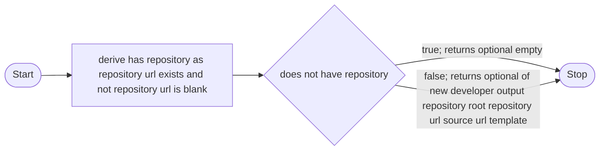

# Self-Tracing Fachtracing

Fachtracing analyzes one of its own production decisions. This example shows the policy that
enables developer graph export in the Maven plugin.

## Generate the Graph

Run:

```sh
./scripts/verify-self-tracing.sh
```

The script installs the current reactor, runs the public `analyze-reactor` Maven goal, and checks
the generated files under `target/fachtracing`.

## Decision Graph

The source method has `@FachTracing("enable developer graph export")`. The verified Mermaid
output is:



This graph shows two result paths:

- If no repository configuration exists, developer graph export is disabled.
- If repository configuration exists, the method creates the developer output settings and
  enables export.

The source method also requires the repository URL and source URL template together. It throws an
exception if only one value exists. The current result graph does not include this direct thrown
validation path. This is a known limit of this self-trace, not a claim that the validation does not
exist.

## What the Gate Proves

The gate uses the same public path as an integrating Maven project. It checks:

- source annotation discovery;
- aggregate reactor source and classpath resolution;
- static business-decision analysis;
- Mermaid and PlantUML rendering;
- index generation; and
- runtime activation data generation.

The generated files stay in `target/fachtracing`. Git does not track them.
